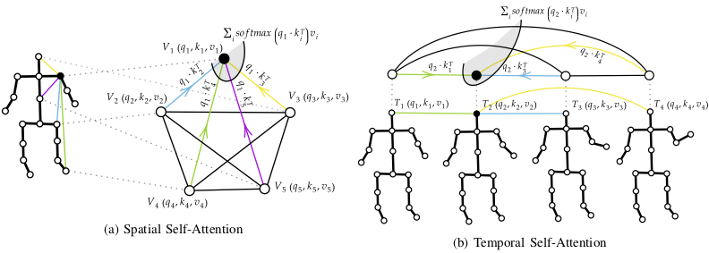

# Spatial Temporal Transformer Network

### Introduction
This repository contains the implementation of the model presented in:

> **Spatial Temporal Graph Convolutional Networks for Skeleton-Based Action Recognition**, Chiara Plizzari, Marco Cannici, Matteo Matteucci, https://arxiv.org/abs/2008.07404 

### Visualizations of Spatial Transformer logits

The heatmaps are 25 x 25 matrices, where each row and each column represents a body joint. An element in position (i, j) represents the correlation between joint i and joint j, resulting from self-attention.

### Prerequisites
- Python3
- Pytorch
- all the libraries in *requirements.txt*

### Run mode
- python3 main.py 

**Training**:
Set in */config/st_gcn/nturgbd/train.yaml*:
- Training: True

**Testing**:
Set in */config/st_gcn/nturgbd/train.yaml*:
- Training: False

### Data generation
We performed our experiments on three datasets: **NTU-RGB+D 60**, **NTU-RGB+D 120** and **Kinetics**. 
## NTU-RGB+D
The data can downloaded from [their website](http://rose1.ntu.edu.sg/datasets/actionrecognition.asp). You need to download **3D Skeletons** only (5.8G (NTU-60) + 4.5G (NTU-120)). Once downloaded, use the following to generate joint data for NTU-60:
<pre><code> python3 ntu_gen_joint_data.py </pre></code>
Then, preprocess them by: 
<pre><code> python3 preprocess.py </pre></code>
In order to generate bones, you need to run: 
<pre><code> python3 ntu_gen_bone_data.py </pre></code>
The joint information and bone information can be merged through:
<pre><code> python3 ntu_merge_joint_bones.py </pre></code>

For NTU-120, the samples are divided between training and testing in a different way. Thus, you need to run: 
<pre><code> python3 ntu120_gen_joint_data.py </pre></code>

Then, use the same functions shown above to generate bone data. 

### Spatial Transformer
Set in */config/st_gcn/nturgbd/train.yaml*:
- attention: True

### Temporal Transformer 
Set in */config/st_gcn/nturgbd/train.yaml*:
- tcn_attention: True
To set the block dimensions of the windowed version of Temporal Transformer:
- dim_block1, dim_block2, dim_block3, respectively to set block dimension where the output channels are equal to 64, 128 and 256.

### Different ST-TR configurations
Set in */config/st_gcn/nturgbd/train.yaml*:
- only_attention: True, to substitute completely convolution with Transformer mechanism
- relative: True, to use relative positional encoding
- all_layers: True, to apply ST-TR on all layers, otherwise it will be applied from the 4th layer on
- more_channels: True, to assign to each head more channels than dk/Nh.
- n: used if more_channels is set to True, in order to assign to each head dk*num/Nh channels

### Second order information
Set in */config/st_gcn/nturgbd/train.yaml*:
- channels: 6, because on channels dimension we have both the coordinates of joint (3), and coordinates of bones(3)
- double_channel: True, since in this configuration we also doubled the channels in each layer.

### To merge S-TR and T-TR (ST-TR)
- python3 ensemble.py

### Citation 
Please cite the following paper if you use this code for your researches:

<pre><code> @misc{plizzari2020spatial,
    title={Spatial Temporal Transformer Network for Skeleton-based Action Recognition},
    author={Chiara Plizzari and Marco Cannici and Matteo Matteucci},
    year={2020},
    eprint={2008.07404},
    archivePrefix={arXiv},
    primaryClass={cs.CV}
  }
</pre></code>
 Note: we include LICENSE, LICENSE_1 and LICENSE_2 in this repository since part of the code has been derived respectively
from https://github.com/yysijie/st-gcn, https://github.com/leaderj1001/Attention-Augmented-Conv2d
and https://github.com/kenziyuliu/Unofficial-DGNN-PyTorch/blob/master/README.md  
