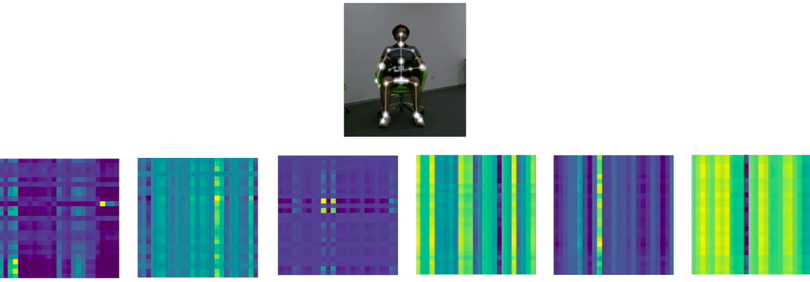

# ST-TR

### Prerequisites
- Python3
- Pytorch
- all the libraries in *requirements.txt*

### Run mode
- python3 main.py 

**Training**:
Set in */config/st_gcn/nturgbd/train.yaml*:
- Training: True

**Testing**:
Set in */config/st_gcn/nturgbd/train.yaml*:
- Training: False

### Data generation
- python3 ntu_gen_joint_data.py (joint)
- preprocess.py to preprocess data
- python3 ntu_gen_bone_data.py (bones)
- python3 ntu_merge_joint_bones.py (merge joint+bones)

### Spatial Transformer
Set in */config/st_gcn/nturgbd/train.yaml*:
- attention: True

### Temporal Transformer 
Set in */config/st_gcn/nturgbd/train.yaml*:
- tcn_attention: True
To set the block dimensions of the windowed version of Temporal Transformer:
- dim_block1, dim_block2, dim_block3, respectively to set block dimension where the output channels are equal to 64, 128 and 256.

### Different ST-TR configurations
Set in */config/st_gcn/nturgbd/train.yaml*:
- only_attention: True, to substitute completely convolution with Transformer mechanism
- relative: True, to use relative positional encoding
- all_layers: True, to apply ST-TR on all layers, otherwise it will be applied from the 4th layer on
- more_channels: True, to assign to each head more channels than dk/Nh.
- n: used if more_channels is set to True, in order to assign to each head dk*num/Nh channels

### Second order information
Set in */config/st_gcn/nturgbd/train.yaml*:
- channels: 6, because on channels dimension we have both the coordinates of joint (3), and coordinates of bones(3)
- double_channel: True, since in this configuration we also doubled the channels in each layer.

### To merge S-TR and T-TR (ST-TR)
- python3 ensemble.py

 Note: we include LICENSE, LICENSE_1 and LICENSE_2 in this repository since part of the code has been derived respectively
from https://github.com/yysijie/st-gcn, https://github.com/leaderj1001/Attention-Augmented-Conv2d
and https://github.com/kenziyuliu/Unofficial-DGNN-PyTorch/blob/master/README.md  
